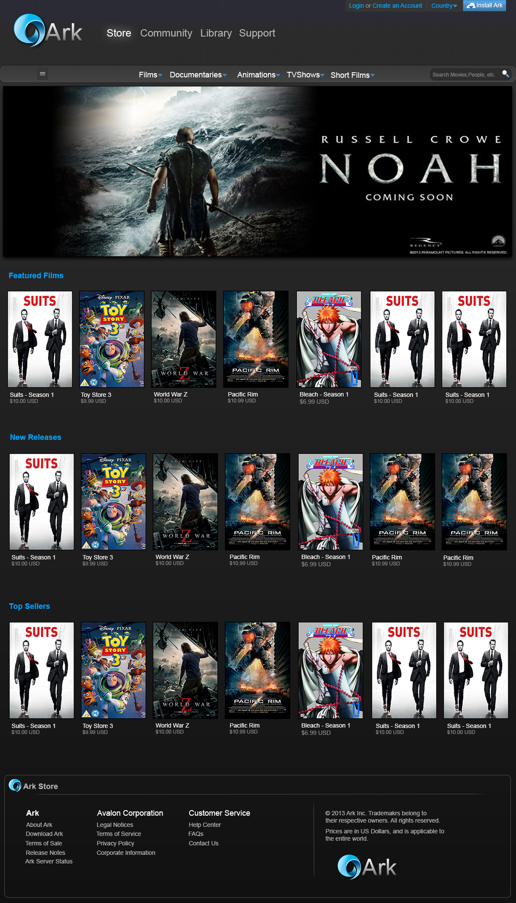
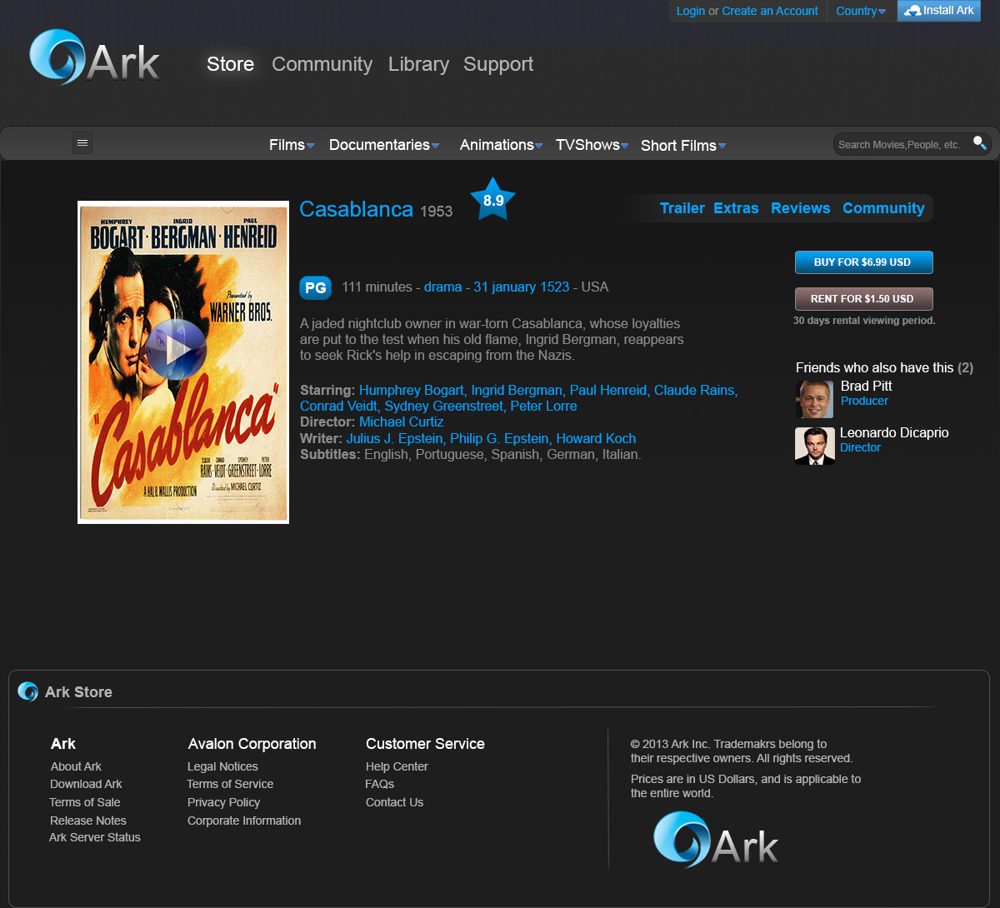
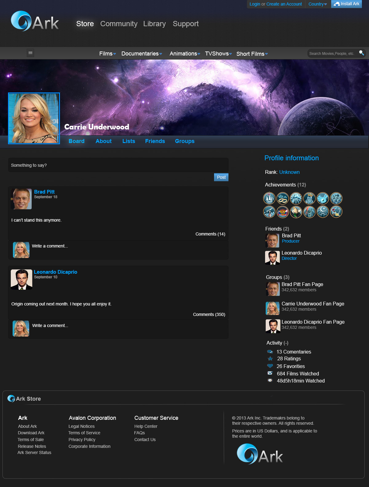
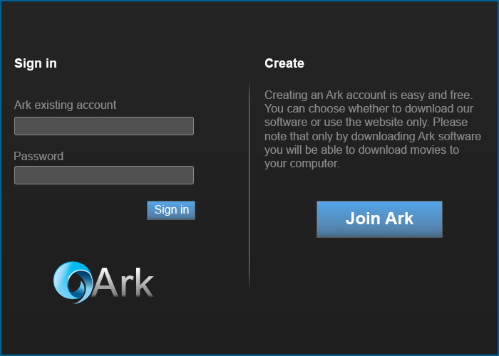
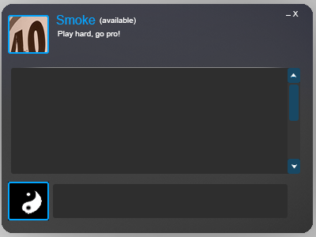

# Ark

This is my biggest project to date. Ark is a digital distribution platform, still in development, for purchasing and watching movies, TV Shows, and Short Films. Ark is also going to offer social networking services. Down below you can check out how the final project is going to look like. All the designs were done by myself using Adobe Photoshop, and I have full ownership over it. Please, do not use it for your own commercial applications.

Technologies: Node.js, Jest, Docker, MongoDB, React.js, Next.js, AWS EC2, GIT

Ark Store
 
This is the main page of the application, where the user will be able to pucharse movies.
 

Ark Movie
 
When user clicks on a movie, he will be taken to this page
 

Ark Community
 
This is the soial network part of the application. Where users will be able to interact with each other, create groups, post messages on their wall, etc.
 

Ark Login
 
Login and create account pup up.
 

Ark Chat
 
This is a long term feature of the application, a chat where users can talk to each other instantaneously. I put it here because I think it looks pretty :)
 

